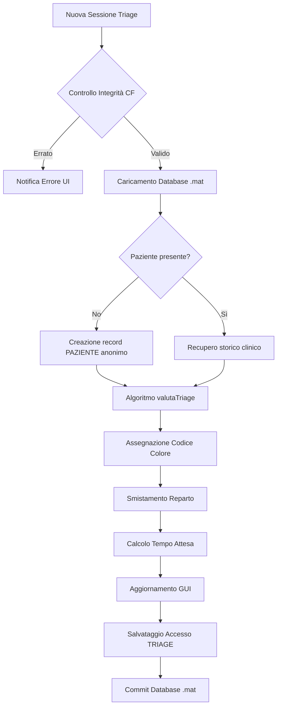

# 🏥 TriageAutomation & LogisticOsp

Applicazione software desktop per l'automazione del triage medico e la gestione decisionale della logistica ospedaliera, sviluppata come elaborato progettuale per il corso di **Fondamenti di Informatica**.

Il sistema acquisisce i parametri vitali del paziente e la sintomatologia corrente, esegue un'analisi incrociata con l'anamnesi storica salvata su un database relazionale locale, assegna un codice colore di urgenza clinica, smista il paziente verso il reparto dedicato e stima dinamicamente i tempi di attesa basandosi sulla saturazione delle risorse disponibili.

> ⚠️ Il progetto è stato sviluppato esclusivamente a scopo didattico e sperimentale. Non è destinato all'utilizzo clinico reale.

---

# 🎯 Obiettivo del progetto

L'obiettivo è modellare il workflow di accoglienza, valutazione e smistamento dei pazienti all'interno di un dipartimento di emergenza-urgenza.

Funzionalità principali:

- Acquisizione guidata dei parametri vitali.
- Controllo integrità dei dati inseriti.
- Storicizzazione degli accessi tramite identificativo univoco.
- Analisi automatica dei parametri fisiologici.
- Assegnazione del codice di urgenza.
- Smistamento verso reparti dedicati.
- Calcolo dinamico dei tempi di attesa.
- Generazione di alert visivi e acustici.

---

# 🔬 Contesto scientifico

Il progetto si colloca nel settore dell'informatica medica applicata ai:

- **Clinical Decision Support Systems (CDSS)**
- **Healthcare Operations Management**

con particolare attenzione all'integrità del dato e all'ottimizzazione dei processi organizzativi sanitari.

---

# ⚙️ Funzionalità principali

| Area | Implementazione |
|---|---|
| Gestione pazienti | Identificazione tramite Codice Fiscale, calcolo età e gestione anonimato |
| Acquisizione dati | Input tramite GUI sviluppata con MATLAB App Designer |
| Persistenza dati | Database locale tramite tabelle MATLAB salvate in file `.mat` |
| Analisi clinica | Classificazione automatica Verde, Giallo, Rosso |
| Smistamento logistico | Assegnazione reparto tramite età e sintomi |
| Gestione code | Stima dei tempi di attesa tramite simulazione della saturazione delle risorse |
| Feedback | Lampade grafiche e segnali acustici di emergenza |

---

# 🧰 Stack tecnologico

- MATLAB R2020a+
- MATLAB App Designer
- MATLAB Table Object Engine
- Audio and Graphic Interface Toolbox

---

# 🔄 Flusso logico del sistema



---

# 🩺 Criteri di Triage

Il modulo analizza:

- Saturazione ossigeno (**SpO₂**)
- Frequenza cardiaca (**FC**)
- Pressione sistolica (**PA**)
- Sintomatologia inserita

## Classificazione clinica

| Parametro | 🟢 Verde | 🟡 Giallo | 🔴 Rosso |
|---|---|---|---|
| SpO₂ | ≥95% | 90%-94% | <90% |
| Frequenza cardiaca | 50-110 bpm | 40-49 bpm / 111-130 bpm | <40 bpm / >130 bpm |
| Pressione sistolica | 90-160 mmHg | 80-89 mmHg / 161-200 mmHg | <80 mmHg / >200 mmHg |
| Sintomi | Assenti | Dolore, dispnea, febbre alta | Arresto, incoscienza, dolore toracico forte |

---

# 🏥 Logica di smistamento

Il sistema assegna automaticamente:

- Medicina
- Cardiologia
- Pediatria

Regole:

- Età inferiore ai 14 anni → Pediatria
- Analisi delle keyword nei sintomi
- Priorità influenzata dal codice colore

---

# 🗄️ Architettura Database

Il database locale è contenuto nel file:

```text
database_ospedale.mat
```

Il sistema utilizza due tabelle:

- `PAZIENTE`
- `TRIAGE`

con relazione:

```
PAZIENTE 1 -------- N TRIAGE
```

---

# 📊 Query MATLAB

## Media tempi di attesa per reparto

```matlab
mean(TRIAGE.MinutiAttesa(strcmp(TRIAGE.RepartoAssegnato,'Medicina')))
```

## Accessi con codice Rosso

```matlab
TRIAGE(strcmp(TRIAGE.CodiceAssegnato,'Rosso'),:)
```

## Storico paziente

```matlab
TRIAGE(strcmp(TRIAGE.FK_Paziente,'CODICEFISCALE16'),:)
```

## Conteggio pazienti pediatrici

```matlab
sum(PAZIENTE.Eta < 14)
```

---

# 📁 Struttura del progetto

```
Progetto_Triage/

├── applicazioneBottone.mlapp
├── valutaTriage.m
├── creaDatabase.m
└── README.md
```

---

# 📌 Limiti del progetto

- Database locale basato su file `.mat`.
- Nessuna connessione a sistemi ospedalieri reali.
- Carico dei reparti simulato tramite valori casuali.
- Algoritmo utilizzato solo a scopo educativo.

---

# 🚀 Sviluppi futuri

- Integrazione database SQL (SQLite/MySQL).
- Modelli avanzati di teoria delle code M/M/c.
- Sistema di autenticazione operatori.
- Gestione avanzata dell'anagrafica.
- Collegamento con sistemi sanitari reali.

---

# 📥 Installazione e utilizzo

## 1. Clonazione repository

```bash
git clone https://github.com/tuo-username/progetto_informatica.git

cd progetto_informatica
```

## 2. Creazione database

Aprire MATLAB ed eseguire:

```matlab
creaDatabase
```

## 3. Avvio applicazione

```matlab
open applicazioneBottone.mlapp
```

Premere il pulsante **Run** in MATLAB App Designer.

---

# 👩‍💻 Autori

Progetto sviluppato per il corso di:

**Fondamenti di Informatica**

Progetto sviluppato da:

**Ginevra Delos Reyes, Matteo Marino**
